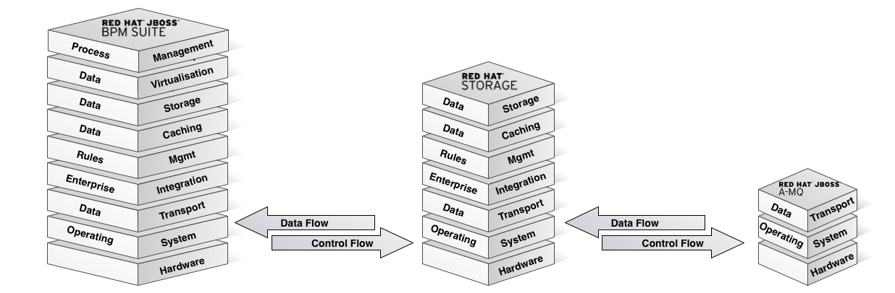

= IoT Demo

:Author:    Patrick Steiner
:Email:     psteiner@redhat.com
:Date:      23.01.2016

:toc: macro

toc::[]

== Purpose
This repository is part of a series of three, which in combination resemble an
Internet of Things ( IoT ) demo-environment, based on the 3-Layered architecture of

* https://github.com/PatrickSteiner/IoT_Demo_Sensors[Edge / Sensors ( this )]: as created of data
* https://github.com/PatrickSteiner/IoT_Demo_Gateway[Smart Gateway / Controller]: first level of data processing
* https://github.com/PatrickSteiner/IoT_Demo_Datacenter[Datacenter]: well, the datacenter ...

These layers can - and in this demo will - be made out of a set of
Red Hat JBoss products, each taking over an important part in the IoT landscape

== Sensors & Actors622157
For this demo-setup, I decided to build physical sensors and actors, based on the ESP8266
microprocessor and various sensors. The documentation on how to build such a sensor can be found
http://www.opensourcerers.org/esp8266-and-dht22-based-smart-sensor/[in my blog]

As of now, I have two different physical devices

* ESP8266 with DHT22 reporting
  ** temperature
  ** humidity
  ** voltage of ESP8266 power supply
* ESP8266 with LED
  ** reporting voltage of ESP8266 power supply
  ** turning LED on and off on command

Both, reporting and action-on messages are received/transmitted via MQTT and a
wireless connection, using the WLAN adapter of the ESP8266.

If you rebuild this demo environment, the
https://github.com/PatrickSteiner/IoT_Demo_Gateway[Smart Gateway] will provide
the MQTT broker and wireless access hub for this.

== Instructions
This document will not replace the instructions needed to build a sensor or
flash an ESP8266, for this you will have to read the relevant websites.

If you do rebuild the demo environment, then there is nothing to change. The
https://github.com/PatrickSteiner/IoT_Demo_Gateway[Smart Gateway] will provide
a network in the 192.168.42.0 subnet with 192.168.42.1 being the ip-address of
the MQTT broker to which the sensors connect.

If you should need instructions on how to adapt this to your needs, please let
me know by creating an https://github.com/PatrickSteiner/IoT_Demo_Sensors/issues[issue]. 
